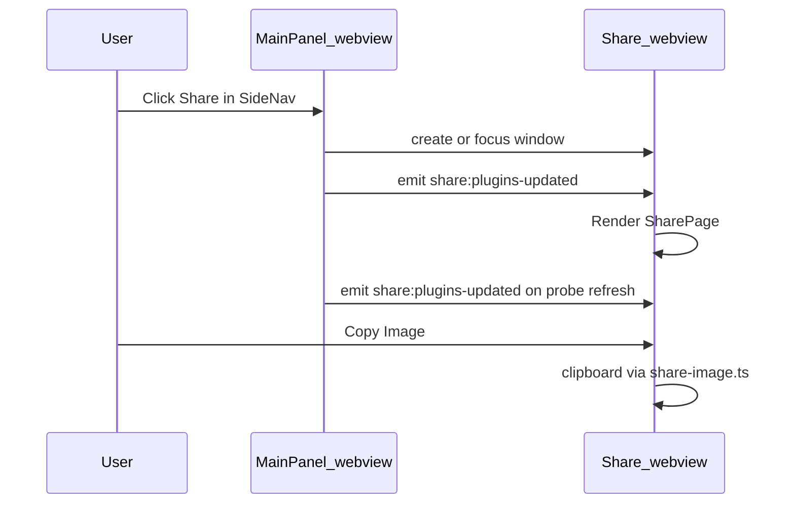

# Share Usage pop-out window — design

**Date:** 2026-07-03
**Status:** Approved (design)

## Goal

Move Share Usage out of the cramped 400px tray panel into a dedicated Tauri window (~480×640). Clicking Share opens or focuses the pop-out; the main panel stays on its current view. Reuse the existing `SharePage` and polish (grouped checklist, plan toggle, prettified names) with live plugin data synced from the main app.

## Decisions

| Decision | Choice | Rationale |
|----------|--------|-----------|
| Window type | Standard decorated `WebviewWindow` (`label: "share"`) | True pop-out; unlike main NSPanel tray dropdown |
| Main panel on Share click | Stays on current view | Pop-out replaces inline share view |
| Inline share view | Removed from `AppContent` (Tauri) | Avoid duplicate UX |
| Layout | Reuse `SharePage` as-is | Same controls, more room |
| Live data | Main emits `share:plugins-updated` with `DisplayPluginState[]` | Share window has no probe loop |
| Init race | Share emits `share:ready` on mount; main responds with snapshot | Avoids lost first payload |
| Browser dev fallback | If `!isTauri()`, keep inline `SharePage` in `AppContent` | `bun run dev` without Tauri still works |
| Share nav active state | Highlight Share icon while share window is visible | Optional polish via window visibility events |

## Architecture

1. **Tauri config** — static `share` window entry in `tauri.conf.json`; capabilities extended to `["main", "share"]` with window show/hide/focus/create permissions and existing clipboard permissions for Copy Image.
2. **Dual entry routing** — `App.tsx` routes by `getCurrentWindow().label`: `"share"` → `ShareWindowApp`, else → `MainApp`.
3. **Share window shell** — `ShareWindowApp` loads theme, listens for `share:plugins-updated`, emits `share:ready` on mount, renders `SharePage` (no SideNav or PanelFooter).
4. **Open/focus helper** — `openShareWindow(plugins)`: get or create window by label, show/focus, emit payload; main re-emits on `displayPlugins` change and responds to `share:ready`.
5. **Side nav** — Share button calls `openShareWindow` instead of `onViewChange("share")`.

## Out of scope

- Side-by-side layout with larger preview.
- Positioning the share window near the tray.
- Persisting share toggle state across sessions (same in-memory-only behavior as today).
- Prettifying model names for providers beyond Claude/Codex (covered by share-polish spec).
